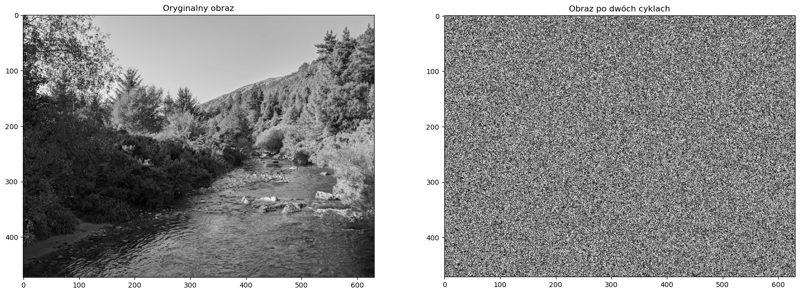
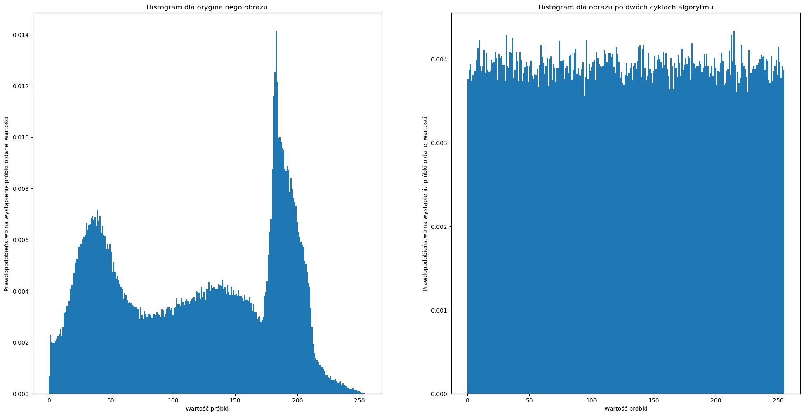
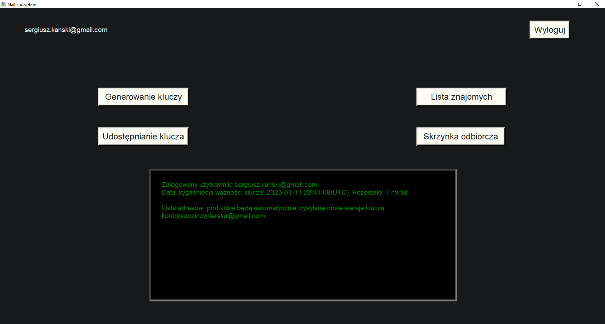

# MailEncryptor

The developed application allows for increased transmission security when using e-mail. The target devices of the application are personal computers with the Windows system. The application is used to encrypt attachments. A hybrid encryption system was used for this purpose. A pair of asymmetric keys is generated automatically after a specified time. The default key validity period was assumed to be one hour. The user can change the key validity period independently. It is also possible to generate keys manually. The AES algorithm in CBC mode was used to encrypt files. The RSA algorithm was used to encrypt the symmetric key. A random number generator was implemented in the application. The generator uses 8-bit grayscale photos as input. However, it is possible to provide color graphics, which are then converted by the application to 8-bit grayscale graphics. The generator is used in the RSA algorithm and when creating a random symmetric key. The software was written using the Python language. For the convenience of using the application, a graphical user interface was implemented.

## Randomness generator result for two cycles - visualization photo
||

## Randomness generator result for two cycles - histogram visualization
||

## Main application view
||

## DApplication operation - recording

### Login to the application

### Key generation

### Downloading the key

### Sending files

### Receiving files

